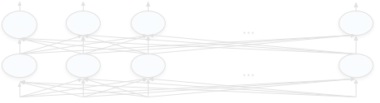
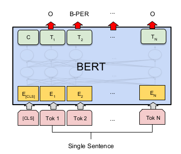

### 简介
[bert](https://arxiv.org/pdf/1810.04805.pdf)模型是Google团队提出的一种基于transformer的双向语言模型。 
它开源了使用中文维基百科所训练的语言模型 https://github.com/google-research/bert 。 
按照论文所述，我使用bert中文预训练模型建立了文本分类及序列标注模型，并且将这些模型与传统的rnn模型进行了简单的对比。

### 文本分类模型

* bert模型
	使用论文中提出的finetune结构，如下图：

图1 bert论文的神经网络结构
 

* 对比模型
使用Bi-lstm模型

* 效果（70%训练，30%测试）
 | 模型 | 准确率 |
|--------|--------|
|        bert| 98%        |
|bi-lstm|95%|

### 序列标注模型

* bert模型
	使用论文中提出的finetune结构，如下图：

图2 bert论文的神经网络结构
 

* 对比模型
使用Bi-lstm+CRF模型

* 效果（70%训练，30%测试）
 | 模型 | 准确率 |
|--------|--------|
|        bert| 98%        |
|bi-lstm+CRF|94%|

### 总结

* bert 在两类问题上比传统模型都有提升
* bert在小数据模型上的优势很明显，迁移学习能力很强
* bert模型很大，在实际生成使用中成本较高，需要深度学习服务器作为支撑
* 对于生产服务器资源有限的情况，可以使用elmo这种基于rnn的语言模型代替
