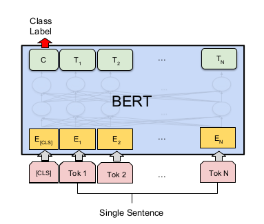

### 简介
[bert](https://arxiv.org/pdf/1810.04805.pdf)模型是Google团队提出的一种基于transformer的双向语言模型。 
它开源了使用中文维基百科所训练的语言模型 
按照论文所述，我使用bert中文预训练模型建立了文本分类及序列标注模型，并且将这些模型与传统的rnn模型进行了简单的对比。

### 文本分类模型

* bert模型
使用论文中提出的finetune结构，如下图：

 
图1 bert论文的神经网络结构

* 对比模型
使用Bi-lstm模型

* 效果（70%训练，30%测试）
 | 模型 | 准确率 |
|--------|--------|
|        bert| 98%        |
|bi-lstm|95%|